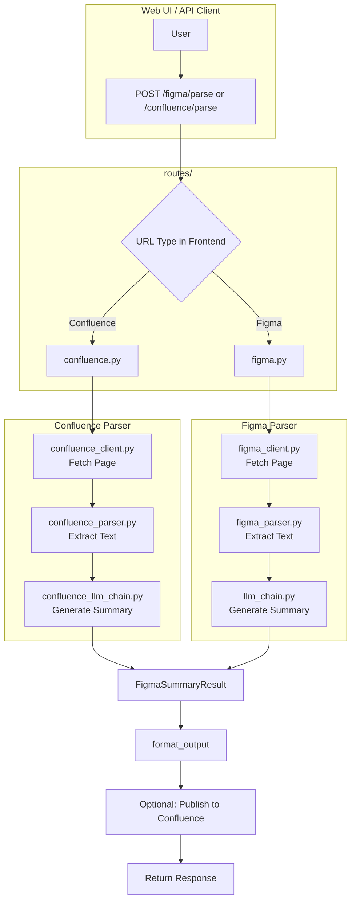

# QA Document Parser Agent API

This project provides a FastAPI-based service that parses Figma files and Confluence documents using LLMs, generating structured summaries and Q&A, and optionally publishing results back to Confluence.

## Features

- **Figma Parsing**: Extracts text and component information from Figma design files.
- **Confluence Parsing**: Fetches and parses text content from Confluence cloud pages (XHTML/Storage format).
- **AI Summary**: Uses OpenAI models (e.g., GPT-4o-mini) to generate a structured summary, execution plan (step-by-step), and Q&A.
- **Confluence Publishing**: Automatically publishes the generated results as a new page in a specified Confluence space.

## Project Structure

```
.
├── config/
│   ├── confluence.py       # Confluence credentials and space settings
│   ├── figma.py            # Figma credentials
│   └── prompts.py          # LLM system/human prompts for each document type
├── modules/
│   ├── figma_agent.py      # Orchestration for Figma parsing
│   ├── figma_client.py     # Figma API client
│   ├── figma_parser.py     # Figma document tree traversal logic
│   ├── confluence_doc_agent.py # Orchestration for Confluence parsing
│   ├── confluence_client.py # Confluence API content fetching
│   ├── confluence_parser.py # Content extraction logic for Confluence
│   ├── confluence_llm_chain.py # Confluence-specific LLM chain
│   └── confluence_agent.py # Shared logic for publishing results to Confluence
├── routes/
│   ├── figma.py            # API routes for Figma parsing
│   └── confluence.py       # API routes for Confluence parsing
├── server.py               # Application entry point and router registration
├── web_ui/                 # Frontend UI components
└── README.md               # Project documentation
```

## Prerequisites

- Python 3.10+
- Figma Access Token
- Confluence Account (Username & API Key)
- OpenAI API Key

## Installation

1.  **Clone the repository**.
2.  **Install dependencies**:
    ```bash
    pip install -r requirements.txt
    ```

3.  **Configuration**:
    Create an `env.json` file in the root directory:
    ```json
    {
        "FIGMA_ACCESS_TOKEN": "your_figma_token",
        "CONFLUENCE_USERNAME": "your_email@example.com",
        "CONFLUENCE_API_KEY": "your_confluence_api_token",
        "OPENAI_API_KEY": "your_openai_api_key"
    }
    ```

## Usage

### Starting the Server

```bash
python server.py
```
*Note: The server runs on port 8000 by default.*

### Web UI
Access the document parser interface at `http://localhost:8000/ui`. The UI automatically detects the URL type (Figma or Confluence) and routes to the correct parser.

## API Endpoints

#### Parse Figma File
- **POST** `/figma/parse`
- **Body**:
    ```json
    {
      "url": "https://www.figma.com/file/...",
      "publish_confluence": true,
      "search_activity_node": true
    }
    ```

#### Parse Confluence Document
- **POST** `/confluence/parse`
- **Body**:
    ```json
    {
      "url": "https://lang.atlassian.net/wiki/...",
      "publish_confluence": false
    }
    ```

## Data Flow



## TODO

- [x] 客服文件生成 (Figma to Markdown)
- [x] 增加寫入到 Confluence 的功能
- [x] 增加不同文件種類的 Parser (Confluence Support)
- [ ] 增加 ES log
